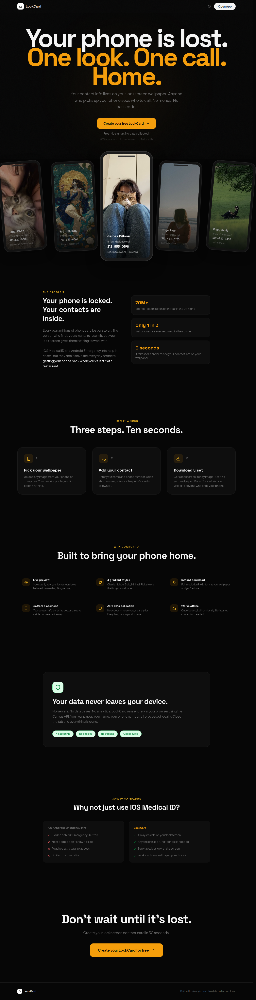

# LockCard



**Turn any wallpaper into a lockscreen contact card.** If your phone is lost, the finder knows who to call — instantly. No passcode. No menus. Just one look.

Every year, **70M+ phones** are lost or stolen. Only **1 in 3** ever make it back. Most people want to return a lost phone — they just don't know who to call. LockCard puts your contact info front and center on your lockscreen, so a good Samaritan can reach you in seconds.

## How It Works

1. **Upload** any wallpaper (photo, solid color, anything)
2. **Enter** your name, phone number, and a short message
3. **Download** a full-resolution PNG and set it as your lockscreen

That's it. Ten seconds. Done.

## Features

- **Live preview** — See exactly how it looks before you download
- **4 gradient styles** — Classic, Subtle, Bold, Minimal
- **Full resolution** — Download at your wallpaper's original resolution
- **Zero data collection** — No servers, no accounts, no analytics. Everything runs in your browser using the Canvas API. Close the tab and it's gone.
- **100% open source** — Built in public. No tracking. No signup. Free forever.
- **Works offline** — After the initial load, everything runs locally

## Why LockCard?

| iOS/Android Emergency Info | LockCard |
|---|---|
| Hidden behind "Emergency" button | Always visible on your lockscreen |
| Most people don't know it exists | Anyone can see it, no tech skills needed |
| Requires extra taps to access | Zero taps — just look at the screen |
| Limited customization | Works with any wallpaper, any gradient |

## Getting Started

```bash
npm run dev     # Start the dev server
npm run build   # Production build
npm run deploy  # Deploy to Cloudflare Pages
```

Built with React, TypeScript, Tailwind CSS, and Vite.
